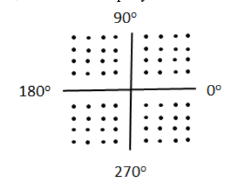

# ТКС тест 1

## 1) Как называется процедура установления, поддержания (управления) и разрыва соединения для передачи данных в телекоммуникационной сети?
Процедура называется "протоколом управления соединением" или "протоколом сеанса".

## 2) Укажите основные функции, которые могут быть реализованы в узлах связи телекоммуникационных сетей?
Они включают в себя маршрутизацию, передачу данных, обработку данных, управление сетью, поддержку служб, управление ресурсами, хранение и кэширование данных, мониторинг и журналирование, а также другие специфические функции в зависимости от типа узла связи.

## 3) В чем отличие информации от данных?
Данные - это необработанные факты, цифры, символы и записи, которые представляют собой сырые материалы, не имеющие особого смысла. Данные могут быть в виде текста, чисел, изображений и т. д.
Информация - это данные, которые были организованы, обработаны и интерпретированы так, чтобы они приобрели смысл, стали полезными и способствовали принятию решений. Информация представляет собой данные, которые имеют контекст и смысл.

## 4) В какой полосе частот передаются данные в каналах тональной частоты?
Данные в каналах тональной частоты передаются в аудиодиапазоне частот, как правило, в диапазоне от 300 Гц до 3,4 кГц. Этот диапазон используется для передачи голосовой информации в телекоммуникационных системах.

## 5) В каких единицах принято измерять пропускную способность каналов связи в современных телекоммуникационных сетях?
Пропускная способность каналов связи измеряется в битах в секунду (бит/с) или килобитах в секунду (кбит/с) для цифровых сетей. В аналоговых сетях может использоваться мера в герцах (Гц) для описания пропускной способности аналоговых каналов.

## 6) Как называется количество данных, которое может быть передано по каналу связи за единицу времени (канал связи, существующий постоянно между двумя пользователями)?
Количество данных, которое может быть передано по каналу связи за единицу времени, измеряется в битах в секунду (бит/с) и обычно называется "битовой скоростью" или "скоростью передачи данных".

## 7) В каких единицах измеряется усиление и ослабление сигнала?
Усиление и ослабление сигнала измеряются в децибелах (дБ).

## 8) В чем состоит удобство вычисления затухания в децибелах?
Удобство вычисления затухания в децибелах заключается в том, что децибелы позволяют представить отношение между двумя величинами (например, мощностью входного и выходного сигнала) в логарифмической форме, что упрощает анализ и сравнение сигналов при различных условиях.

## 9) Во сколько раз уменьшится мощность сигнала на расстоянии 100 м, если его ослабление равно: d=10 дБ/км?
Уменьшение мощности сигнала на расстоянии 100 м при ослаблении d = 10 дБ/км может быть рассчитано следующим образом: Для 100 м (0,1 км) при ослаблении 10 дБ/км: Ослабление = 0,1 км * 10 дБ/км = 1 дБ. Таким образом, мощность сигнала уменьшится на 1 дБ.

## 10) Передатчик формирует сигнал, мощность которого равна 100 Вт. Чему равна мощность сигнала в приемнике, расположенном на расстоянии 1000 м от передатчика, если известно, что затухание в канале связи составляет 100 дБ/км?
Для рассчета мощности сигнала в приемнике на расстоянии 1000 м с учетом затухания 100 дБ/км: Исходная мощность передачи (100 Вт) уменьшится на: 1000 м * 100 дБ/км = 100,000 дБ  Итак, мощность сигнала в приемнике составит 100 Вт - 100,000 дБ = 0,000001 Вт (или 1 мкВт).

## 11) Абсолютная мощность равна 1 кВт. Чему равна опорная мощность?
Опорная мощность (или опорный уровень) часто определяется как мощность, при которой производительность какой-либо системы или устройства максимальна или устанавливается как стандарт для сравнения. В данном случае, опорная мощность не была указана, поэтому невозможно точно определить её значение.

## 12) Порог чувствительности приемника 1 мВт. Чему должна быть равна мощность формируемого в передатчике сигнала (кВт), расположенного на расстоянии 40 км от приемника, если известно, что затухание в канале связи составляет 1,5 дБ/км?
Для расчета мощности формируемого сигнала в передатчике, чтобы достичь порога чувствительности приемника (1 мВт) на расстоянии 40 км с учетом затухания 1,5 дБ/км, можно использовать следующую формулу: Затухание на расстоянии 40 км = 40 км * 1,5 дБ/км = 60 дБ.  Требуемая мощность на приемнике = Мощность формируемого сигнала - Затухание.  1 мВт = Мощность формируемого сигнала - 60 дБ. Мощность формируемого сигнала = 1 мВт + 60 дБ = 1 Вт (или 1000 мВт).

## 13) Какие параметры гармонического сигнала могут нести информацию? 
Гармонический сигнал может нести информацию через такие параметры, как амплитуда, частота и фаза. Изменения в этих параметрах могут кодировать данные или сообщения, такие как в аналоговой модуляции.

## 14) Какой спектр частот характерен для дискретных сигналов? 
Дискретные сигналы обладают дискретным спектром частот, который характеризуется наличием только определенных дискретных частотных компонентов. Спектр дискретных сигналов состоит из отдельных линий частот.

## 15) При каких условиях обеспечивается качественная передача сигнала? 
Качественная передача сигнала обычно обеспечивается при соблюдении следующих условий: Подходящая полоса пропускания канала для передаваемого сигнала.  Низкий уровень шума в канале.  Отсутствие искажений сигнала на пути передачи.  Адекватное соотношение сигнал-шум (S/N).  Устойчивость канала к интерференциям и помехам.

## 16) Что произойдет, если спектр сигнала больше полосы пропускания канала? 
Если спектр сигнала больше полосы пропускания канала, то часть информации может быть утрачена. В этом случае необходимо использовать методы фильтрации или модуляции для адаптации сигнала к полосе пропускания канала.

## 17) Какую полосу пропускания имеет канал тональной частоты? 
Полоса пропускания канала тональной частоты обычно включает в себя аудиодиапазон частот от 300 Гц до 3,4 кГц.

## 18) Определить динамический диапазон сигнала, у которого минимальная, пиковая и средняя мощности соответственно равны: 1 мкВт, 1 Вт и 1 мВт. 
Динамический диапазон сигнала рассчитывается как разница между максимальной и минимальной мощностями сигнала. В данном случае: Минимальная мощность = 1 мкВт = 0,000001 Вт. Пиковая мощность = 1 Вт. Средняя мощность = 1 мВт = 0,001 Вт. Динамический диапазон = Пиковая мощность - Минимальная мощность = 1 Вт - 0,000001 Вт = 0,999999 Вт.

## 19) Как передаются сигналы в высокоскоростных каналах связи с резко ограниченной полосой частот? 
В высокоскоростных каналах связи с ограниченной полосой частот обычно используют методы модуляции, такие как квадратурная амплитудная модуляция (QAM) или фазовая модуляция (PSK), чтобы кодировать данные в сигналы, которые могут быть переданы через ограниченный диапазон частот.

## 20) Что такое модуляция и для чего она нужна? 
Модуляция - это процесс изменения одного или нескольких параметров носителя, таких как амплитуда, частота или фаза, для кодирования информации. Модуляция используется для передачи данных через каналы связи, изменяя характеристики сигнала для адаптации его к требованиям канала.

## 21) Чем манипуляция отличается от модуляции?
Манипуляция (амплитудная, частотная, фазовая и другие) - это процесс изменения формы сигнала с целью кодирования информации в самой форме сигнала, а не в одном из параметров носителя, как это делается при модуляции. Манипуляция может включать в себя изменения в амплитуде, частоте или фазе сигнала для передачи данных. Манипуляция отличается от модуляции тем, что информация кодируется изменениями в форме сигнала, а не параметрах носителя.
## 22) Пояснить принцип амплитудной, частотной и фазовой модуляции.
Амплитудная модуляция (АМ): При амплитудной модуляции информация кодируется изменением амплитуды несущего сигнала. Амплитуда несущего сигнала изменяется в соответствии с входным сигналом. Высокая амплитуда соответствует логической "1", а низкая амплитуда - логической "0". Примером является аналоговое FM-радиовещание.

Частотная модуляция (ФМ): При частотной модуляции информация кодируется изменением частоты несущего сигнала. Частота несущего сигнала изменяется в зависимости от входного сигнала. Это также используется в радиовещании, особенно в FM-радио.

Фазовая модуляция (ФМ): При фазовой модуляции информация кодируется изменением фазы несущего сигнала. Фаза сигнала изменяется в соответствии с входным сигналом. Фазовая модуляция используется, например, в цифровой коммуникации.

## 23) Что такое ИКМ? 
ИКМ - это информационная космическая модуляция. Это метод модуляции сигнала, который используется в спутниковых связях для передачи данных через космические среды.

## 24) Пояснить различие между АИМ и ИКМ. 
Различие между АИМ (амплитудной информационной модуляцией) и ИКМ (информационной космической модуляцией: АИМ изменяет амплитуду сигнала для кодирования информации, в то время как ИКМ предназначена для работы в космических условиях и учитывает особенности связи через космические среды, включая затухание и другие параметры.

## 25) Основной недостаток АИМ. 
Основной недостаток АИМ (амплитудной информационной модуляции) заключается в его уязвимости к помехам и атмосферным воздействиям. Амплитуда сигнала может быть искажена шумом, что делает его менее надежным для долгих передач данных на большие расстояния.

## 26) Показать, за счет чего обеспечивается скорость передачи данных в 64 кбит/с (56 кбит/с; 32 кбит/с) при ИКМ. 
Скорость передачи данных в 64 кбит/с (56 кбит/с; 32 кбит/с) при ИКМ (информационной космической модуляции) достигается за счет использования различных методов кодирования и модуляции, а также оптимизации передачи данных в космических условиях. Это может включать в себя адаптацию канала связи и коррекцию ошибок.

## 27) Раскрыть аббревиатуру и пояснить принцип АД ИКМ. 
АД ИКМ - это Антарктическая Динамическая информационная модуляция. Это конкретный вид ИКМ, предназначенный для обеспечения связи в антарктической области.

## 28) Какой эффект достигается при использовании методов квадратурной модуляции? 
Методы квадратурной модуляции позволяют кодировать информацию с использованием одновременного изменения амплитуды и фазы несущего сигнала. Это обеспечивает высокую эффективность использования доступной полосы пропускания канала и позволяет передавать больше данных в единицу времени.

## 29) Что такое QAM-16?
QAM-16 (Quadrature Amplitude Modulation 16) - это метод квадратурной модуляции, который использует 16 различных состояний амплитуды и фазы для кодирования информации. Это означает, что каждый символ может представлять 4 бита информации (поскольку 2^4 = 16). QAM-16 часто используется в цифровых коммуникационных системах, таких как цифровое телевидение и беспроводные сети.

## 30) Какой метод модуляции показан на рисунке:

QUAM64

## 31) Во сколько раз увеличивается скорость передачи данных при модуляции (манипуляции) по методу QAM-64 по сравнению с QPSK (QAM-16)?
Скорость передачи данных при использовании метода QAM-64 увеличивается в 4 раза по сравнению с QPSK (QAM-16).

## 32) Нарисовать амплитудно-фазовую диаграмму для метода модуляции (манипуляции)

## 33) Как называется процесс представления непрерывных (дискретных) данных в виде физических сигналов для их передачи по каналам связи? 
Процесс представления непрерывных (дискретных) данных в виде физических сигналов для их передачи по каналам связи называется модуляцией.
## 34) От чего зависит спектр результирующего модулированного сигнала? 
Спектр результирующего модулированного сигнала зависит от нескольких факторов, включая тип модуляции, частоту несущего сигнала, амплитуду модулирующего сигнала и фазовые параметры.
## 35) Как спектр результирующего модулированного сигнала зависит от скорости модуляции (скорости передачи данных)? 
Спектр результирующего модулированного сигнала зависит от скорости модуляции, так как изменение скорости модуляции влияет на ширину спектра и распределение энергии сигнала в спектре. Более высокая скорость модуляции может привести к широкому спектру.
## 36) Какие методы модуляции используются для представления непрерывных данных в виде непрерывных (дискретных) сигналов? 
Методы модуляции, используемые для представления непрерывных данных в виде непрерывных (дискретных) сигналов, включают амплитудную модуляцию (AM), частотную модуляцию (FM) и фазовую модуляцию (PM) для аналоговых сигналов, а также методы кодирования, такие как амплитудная фазовая модуляция (APSK) и квадратурная амплитудная модуляция (QAM), для цифровых сигналов.
## 37) Как называется аналоговый высокочастотный сигнал, подвергаемый модуляции в соответствии с некоторым информативным сигналом? 
Аналоговый высокочастотный сигнал, подвергаемый модуляции в соответствии с некоторым информативным сигналом, называется модулированным сигналом.
## 38) Чему равна скорость передачи речевых данных (бит/с) при использовании импульсно-кодовой модуляции?
Скорость передачи речевых данных при использовании импульсно-кодовой модуляции (PCM) зависит от количества битов, представляющих каждый сэмпл речи, и частоты сэмплирования. Обычно используется 8 бит на сэмпл и частота сэмплирования 8 кГц, что приводит к скорости передачи 64 кбит/с.
## 39) Перечислить требования к методам цифрового кодирования. 
Требования к методам цифрового кодирования включают в себя минимизацию ошибок при передаче данных, эффективное использование пропускной способности канала, минимизацию задержек, устойчивость к помехам и возможность восстановления данных при их потере.
## 40) Как битовая скорость связана со спектром результирующего сигнала? 
Битовая скорость связана со спектром результирующего сигнала через закон Хартли. С увеличением битовой скорости расширяется и спектр сигнала.
## 41) В чем заключается проблема синхронизации при передаче цифровых сигналов? 
Проблема синхронизации при передаче цифровых сигналов заключается в правильном определении начала и конца символов или битов при приеме данных, особенно в условиях потери синхронизации.
## 42) Какие методы кодирования относятся к самосинхронизирующимся? 
К самосинхронизирующимся методам кодирования относятся методы, которые включают специальные коды, позволяющие получить синхронизацию даже при потере некоторых битов (например, кодирование с помощью манчестерского кода).
## 43) От чего зависит стоимость реализации метода кодирования? 
Стоимость реализации метода кодирования зависит от нескольких факторов, включая сложность аппаратной реализации кодирования и декодирования, использование дополнительных ресурсов, таких как чипы или оборудование, и соответствие стандартам и требованиям качества.
## 44) Что такое постоянная составляющая спектра сигнала и почему она нежелательна? 
Постоянная составляющая спектра сигнала - это часть спектра, которая находится вблизи нулевой частоты (постоянной составляющей) и обычно связана с постоянной компонентой сигнала. Она нежелательна, так как может вызвать смещение уровня постоянного тока и нежелательные эффекты при передаче данных.
## 45) Какие методы кодирования имеют постоянную составляющую в спектре сигнала? 
Методы кодирования, такие как NRZ (Небалансное Кодирование с нулевой средней), могут иметь постоянную составляющую в спектре сигнала, особенно если длина последовательности нулей или единиц длительна.
## 46) Почему проблема синхронизации в телекоммуникационных сетях решается сложнее, чем при обмене данными между компьютером и принтером? 
Проблема синхронизации в телекоммуникационных сетях решается сложнее, чем при обмене данными между компьютером и принтером, потому что сети часто включают множество участников и компонентов, и синхронизация требует более сложных и надежных механизмов.
## 47) К каким неприятным последствиям может привести рассинхронизация при передаче данных? 
Рассинхронизация при передаче данных может привести к ошибкам при декодировании данных и потере части или всех передаваемых данных. Это может привести к сбоям в работе приемника и неверной интерпретации данных.
## 48) Для чего в электрических линиях связи нужна гальваническая развязка? 
Гальваническая развязка в электрических линиях связи используется для предотвращения электрического контакта между двумя системами или устройствами, чтобы избежать гальванических петель, помех и электрических проблем, связанных с потенциалами и заземлением.
## 49) Какими достоинствами (недостатками) обладает метод кодирования NRZ (RZ, …)? 
Метод кодирования NRZ (Небалансное Кодирование с нулевой средней) обладает преимуществами, такими как простота реализации и отсутствие необходимости в дополнительных частотных компонентах, но у него может быть постоянная составляющая в спектре сигнала. Это может быть недостатком, так как постоянная составляющая нежелательна.
## 50) В каком случае при потенциальном кодировании NRZ отсутствует постоянная составляющая в передаваемом сигнале?
При потенциальном кодировании NRZ отсутствует постоянная составляющая в передаваемом сигнале, что делает его более предпочтительным для определенных приложений, так как устраняется проблема постоянной составляющей в спектре сигнала.
## 51) В каких методах кодирования используются два (три, …) уровня сигнала?
В двоичном методе кодирования (Binary Encoding) используются два уровня сигнала: 0 и 1. Троичный метод (Ternary Encoding) использует три уровня сигнала: -1, 0 и 1.

## 52) У каких из перечисленных методов физического кодирования отсутствует постоянная составляющая: NRZ, RZ, AMI, NRZI, MLT-3, Manchester-2, PAM-5?
Постоянная составляющая отсутствует у методов кодирования NRZ, RZ, и Manchester-2.

## 53) Сколько уровней сигнала используется для передачи данных в методе кодирования PAM-5 (RZ, …)?
Метод кодирования PAM-5 использует 5 уровней сигнала.

## 54) Сколько избыточных (запрещённых) кодов содержится в методе логического кодирования 8В/10В?
Метод логического кодирования 8B/10B содержит 2 избыточных (запрещенных) кода.

## 55) Чему равна избыточность (в процентах) логического кодирования 5В/6В?
Избыточность логического кодирования 5B/6B равна 20%.

## 56) Какие методы относятся к методам логического кодирования?
Методы логического кодирования включают в себя 8B/10B, 5B/6B и другие подобные методы.

## 57) Назначение логического кодирования.
Логическое кодирование используется для обеспечения устойчивости и надежности передачи данных, а также для контроля ошибок.

## 58) В чём различие между линейным и первичным сигналом?
Линейный сигнал является исходным аналоговым сигналом, в то время как первичный сигнал - это сигнал, полученный после преобразования (кодирования, модуляции) и готовый к передаче по каналу связи.

## 59) Что такое АПД?
АПД - это Активное Пассивное Двойственное устройство, которое может работать как передатчик и как приёмник сигнала.

## 60) Какие устройства относятся к АПД?
Примеры устройств, относящихся к АПД, включают ретрансляторы и повторители сигнала.

## 61) Как называется процесс объединения нескольких входящих в узел потоков данных в один выходящий из узла поток?
Этот процесс называется мультиплексированием.

## 62) Назначение мультиплексора (демультиплексора).
Мультиплексор объединяет несколько входящих потоков данных в один, а демультиплексор выполняет обратную операцию, разделяя один входящий поток данных на несколько выходящих.

## 63) Перечислить характеристики цифрового канала связи.
Характеристики цифрового канала связи включают пропускную способность, скорость передачи данных, BER (битовую скорость ошибок) и другие параметры.

## 64) В каких единицах измеряется скорость модуляции?
Скорость модуляции измеряется в бодах (битах в секунду).

## 65) Полоса пропускания канала равна 100 МГц. Чему равна максимальная скорость модуляции?
Максимальная скорость модуляции равна половине полосы пропускания, то есть 50 Мбит/с.

## 66) От чего зависит пропускная способность канала связи?
Пропускная способность канала связи зависит от ширины полосы пропускания и отношения сигнал/шум.

## 67) Что такое BER?
BER (Bit Error Rate) - это показатель, который определяет вероятность возникновения ошибки при передаче данных через канал связи. Он измеряется в виде отношения числа ошибочно переданных бит к общему числу переданных бит.
## 68) В чем отличие полудуплексного канала от дуплексного?
Полудуплексный канал позволяет передавать данные в обоих направлениях, но только в одном направлении за раз. То есть, передача данных может происходить только в одном направлении в определенный момент времени. В дуплексном канале же возможна одновременная передача данных в обоих направлениях.
## 69) Рассчитать максимально возможную пропускную способность (Мбит/с) канала связи при условии, что ширина полосы пропускания равна 20 МГц, а отношение мощности сигнала к мощности шума равно 3.
Максимально возможная пропускная способность канала связи может быть рассчитана с использованием формулы Шеннона:
Пропускная способность = ширина полосы пропускания * log2(1 + отношение мощности сигнала к мощности шума)
Пропускная способность = 20 МГц * log2(1 + 3) = 20 МГц * log2(4) = 20 МГц * 2 = 40 Мбит/с
Таким образом, максимально возможная пропускная способность канала связи составляет 40 Мбит/с.
## 70) Чему равна пропускная способность канала связи с полосой пропускания 100 МГц при использовании кодирования по методу PAM-5 (Манчестер 2, RZ, …)?
Пропускная способность канала связи при использовании кодирования по методу PAM-5 (Pulse Amplitude Modulation) зависит от скорости передачи данных и количества уровней амплитуды сигнала.
    Для метода PAM-5 используется 5 уровней амплитуды, что позволяет кодировать 3 бита информации в каждом символе. Таким образом, скорость передачи данных будет равна половине пропускной способности канала.
    Пропускная способность канала связи с полосой пропускания 100 МГц при использовании метода PAM-5 будет равна:
    Пропускная способность = 100 МГц / 2 = 50 Мбит/с
    Таким образом, пропускная способность канала связи составит 50 Мбит/с при использовании метода PAM-5.
## 71) В чём отличие цифрового канала связи от непрерывного?
Цифровой канал связи передает данные в виде дискретных значений, представленных в виде битов (0 и 1). Он использует методы кодирования и декодирования для представления и восстановления информации. Цифровой канал связи обеспечивает более надежную передачу данных и имеет возможность обнаружения и исправления ошибок.
    Непрерывный канал связи, с другой стороны, передает данные в виде аналоговых сигналов, которые могут принимать любые значения в заданном диапазоне. Он не использует методы кодирования и декодирования, и данные передаются без изменений. Непрерывный канал связи может быть более подвержен помехам и искажениям сигнала.
## 72) Назначение фильтров в канале связи.
Фильтры в канале связи используются для контроля и управления частотным спектром сигнала. Они выполняют различные функции, включая:
    Подавление помех: Фильтры могут удалять нежелательные частоты, которые могут вызывать помехи и искажения сигнала. Это позволяет улучшить качество передачи данных.
    Разделение каналов: Фильтры могут разделять различные каналы связи, работающие на разных частотах, чтобы предотвратить взаимное влияние и помехи между ними.
    Формирование сигнала: Фильтры могут изменять форму сигнала, например, сглаживать его или изменять его амплитуду и фазу. Это может быть полезно для адаптации сигнала к требованиям конкретной системы связи.
    Усиление сигнала: Фильтры могут усиливать сигналы на определенных частотах, чтобы компенсировать потери сигнала в канале связи.
    Фильтры играют важную роль в обеспечении надежной и качественной передачи данных в канале связи.
## 73) В чём отличие пропускной способности от полосы пропускания (скорости передачи данных)?
Пропускная способность и полоса пропускания (скорость передачи данных) - это два разных понятия, связанных с передачей данных в канале связи.
    Полоса пропускания (скорость передачи данных) определяет максимальную скорость, с которой данные могут быть переданы через канал связи. Она измеряется в битах в секунду (бит/с) или в мегабитах в секунду (Мбит/с). Например, скорость передачи данных 100 Мбит/с означает, что канал способен передавать 100 миллионов бит в секунду.
    Пропускная способность, с другой стороны, определяет количество данных, которые могут быть переданы через канал связи за определенный период времени. Она измеряется в битах (или байтах) в секунду. Например, пропускная способность 1 Гбит/с означает, что канал способен передать 1 гигабит данных за одну секунду.
    Таким образом, полоса пропускания (скорость передачи данных) определяет максимальную скорость передачи данных, а пропускная способность определяет количество данных, которые могут быть переданы за определенный период времени.
## 74) Какие методы мультиплексирования применяются в современных телекоммуникационных сетях?
В современных телекоммуникационных сетях применяются различные методы мультиплексирования для эффективного использования доступной пропускной способности канала связи. Некоторые из них включают:
    Частотное разделение (FDM - Frequency Division Multiplexing): Различные каналы связи используют разные частотные диапазоны для передачи данных. Это позволяет передавать несколько независимых сигналов одновременно.
    Временное разделение (TDM - Time Division Multiplexing): Различные каналы связи используют разные временные слоты для передачи данных. Каждый канал получает определенный интервал времени для передачи своих данных.
    Кодовое разделение (CDM - Code Division Multiplexing): Различные каналы связи используют разные коды для передачи данных. Коды позволяют различать и извлекать данные отдельных каналов из общего сигнала.
    Длинноволновое разделение (WDM - Wavelength Division Multiplexing): Различные каналы связи используют разные длины волн света для передачи данных в оптических сетях. Это позволяет передавать несколько независимых сигналов по одному оптоволоконному кабелю.
    Эти методы мультиплексирования позволяют повысить эффективность использования пропускной способности канала связи и обеспечить одновременную передачу нескольких независимых сигналов.
## 75) Что такое FDM?
FDM (Frequency Division Multiplexing) - это метод мультиплексирования, при котором различные каналы связи используют разные частотные диапазоны для передачи данных. Каждый канал занимает свою уникальную частоту, и сигналы разных каналов смешиваются вместе для передачи по общему каналу связи.
    FDM позволяет передавать несколько независимых сигналов одновременно, используя разные частоты. На приемной стороне сигналы разделяются и восстанавливаются в исходные данные для каждого канала.
    FDM широко применяется в телекоммуникационных системах, особенно в радио- и телевизионных передачах, где необходимо передавать множество независимых сигналов одновременно.
## 76) Что такое «слот» в TDM?
В TDM (Time Division Multiplexing) "слот" - это временной интервал, выделенный для передачи данных отдельного канала связи. В TDM различные каналы связи используют разные временные слоты для передачи данных.
    В TDM каждый канал получает определенный интервал времени, называемый слотом, в котором он может передавать свои данные. Все слоты повторяются в циклическом порядке, образуя TDM-кадр. Каждый канал передает свои данные только в своем слоте, и приемная сторона восстанавливает данные для каждого канала, используя информацию о слотах.
    Слоты в TDM обеспечивают справедливое распределение времени между различными каналами связи и позволяют передавать несколько независимых сигналов одновременно.
## 77) Чем асинхронное TDM отличается от синхронного?
Асинхронное TDM (Asynchronous Time Division Multiplexing) и синхронное TDM (Synchronous Time Division Multiplexing) - это два различных подхода к мультиплексированию временных слотов в TDM.
    В асинхронном TDM каждый канал связи может передавать данные только тогда, когда они доступны. Временные слоты могут быть неравномерными и не фиксированной длительности. Это означает, что слоты могут быть использованы только в том случае, если у канала есть данные для передачи. Это позволяет более гибко использовать доступное время, но может привести к неравномерной загрузке канала и потере эффективности использования пропускной способности.
    В синхронном TDM все каналы связи используют фиксированные временные слоты одинаковой длительности. Даже если у канала нет данных для передачи, он все равно занимает свой слот. Это обеспечивает равномерную загрузку канала и более эффективное использование пропускной способности, но может привести к неиспользованию доступного времени, если у канала нет данных для передачи.
    Таким образом, основное отличие между асинхронным и синхронным TDM заключается в гибкости использования временных слотов и равномерности загрузки канала.
## 78) Что такое DWDM?
DWDM (Dense Wavelength Division Multiplexing) - это метод мультиплексирования, который позволяет передавать несколько независимых сигналов по одному оптоволоконному кабелю, используя различные длины волн света. Он основан на принципе, что различные сигналы могут быть переданы одновременно, если они используют разные длины волн света.
